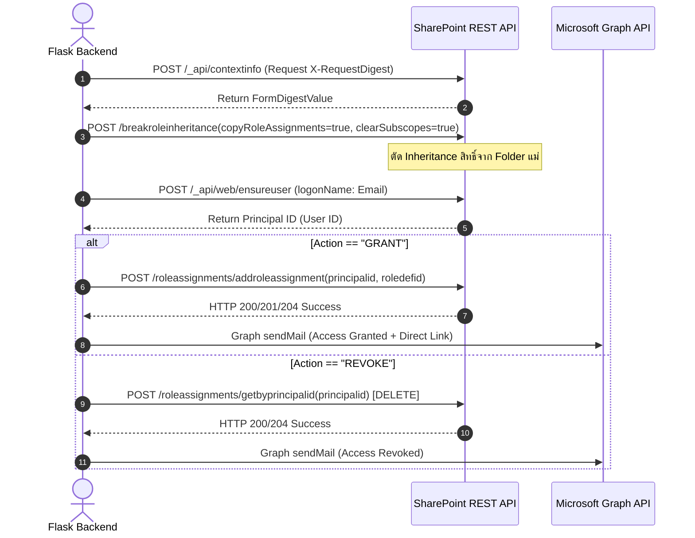

# 📘 Technical Documentation & Knowledge Base
## SharePoint Permission Manager (MTI Budget 2026)

เอกสารสรุปสถาปัตยกรรมระบบ โครงสร้างข้อมูล และคู่มือการพัฒนาต่อสำหรับ **SharePoint Permission Manager** ซึ่งเป็นระบบบริหารจัดการสิทธิ์ (Access Control System) บน SharePoint Online แบบอัตโนมัติ ออกแบบมาเพื่อรองรับการจัดสรรสิทธิ์โฟลเดอร์งบประมาณ MTI Budget 2026 ผ่าน Web Dashboard (Flask Framework) ร่วมกับการอัปเดตไฟล์ Excel และการส่งแจ้งเตือนผ่านอีเมล

---

## 1. 🏗 System Architecture & Directory Structure

```text
sharepoint-permission-manager/
├── data/
│   └── excel_config.xlsx        # ไฟล์ Excel กำหนด URL หลัก และตารางรายชื่อผู้ได้รับสิทธิ์
├── config/
│   ├── .env                     # ค่าความลับสำหรับการเชื่อมต่อ
│   └── .env.example             # ตัวอย่างค่าตั้งต้น
├── static/
│   └── js/
│       └── app.js               # Frontend Controller (Fetch API, DOM Rendering, Console Logger)
├── templates/
│   └── index.html               # Web UI Dashboard หน้าหลัก (Bootstrap 5 + FontAwesome)
├── app/
│   ├── excel_service.py         # Service อ่าน/บันทึกไฟล์ Excel (Pandas + OpenPyXL)
│   ├── sharepoint_service.py    # Core Service บริหารจัดการสิทธิ์ SharePoint REST API & Email Engine
│   └── main.py                  # Flask HTTP Server & Gateway API Controller
├── sp_cookies.json              # ไฟล์จัดเก็บ Cookie Authentication (rtFa, FedAuth)
└── requirements.txt             # รายการ Python Package Dependencies
```

### องค์ประกอบเชิงระบบ (System Components)
```
  [ User / Admin ]
         │
         ▼
 ┌────────────────┐       Read Config       ┌──────────────────────┐
 │   index.html   │ ──────────────────────> │  excel_config.xlsx   │
 │    (app.js)    │ <────────────────────── │ (Sheet: Main/Manage) │
 └───────┬────────┘    Render Data Table    └──────────────────────┘
         │
    Post Selected
      IDs & Action
         │
         ▼
 ┌────────────────┐   1. Break Inheritance  ┌──────────────────────┐
 │    main.py     │ ──2. Ensure User (ID)─> │   SharePoint Online  │
 │  (Flask API)   │ ──3. Add/Remove Role──> │     REST API Web     │
 └───────┬────────┘                         └──────────────────────┘
         │
         ├────────────────────────────────> ┌──────────────────────┐
         │     Send Notification Email      │ Microsoft Graph API   │
         │     (HTML + Direct Folder Link)  │  (OAuth 2.0)          │
         │                                  └──────────────────────┘
         ▼
 ┌────────────────┐
 │ update_excel   │ ──────────────────────>  Write back Status, Logs_Date,
 │   _logs()      │                          and Remark to Excel
 └────────────────┘
```

---

## 2. 📊 Data Structure & Excel Schema

ไฟล์ `data/excel_config.xlsx` แบ่งออกเป็น 2 Sheets หลัก:

### 2.1 Sheet: `Main`
เก็บตั้งค่า Root Path ของ SharePoint Site
* **Cell [Row 2, Column B]**: เก็บ `main_path_url` เช่น 
  `https://muangthaiinsurance.sharepoint.com/sites/MTI-Finance-Budgeting/Shared%20Documents/General/++Budget2026/`

### 2.2 Sheet: `Manage Permission`
เก็บข้อมูลตารางกำหนดสิทธิ์ เริ่มอ่านข้อมูลตั้งแต่ **Row Index 3** (Header อยู่ใน Row 1-2)

| Col | Column Name | Python Index | Data Type | Description |
| :---: | :--- | :---: | :---: | :--- |
| **A** | ลำดับ (ID) | Col 0 | Integer/String | Identifier ประจำรายการ |
| **B** | Path_ย่อย | Col 1 | String | Sub-folder path ที่ต้องการจัดการสิทธิ์ |
| **C** | *(Reserved)* | Col 2 | - | คอลัมน์สำรอง |
| **D** | Email | Col 3 | String | UPN / Email ของผู้ใช้งานใน Tenant |
| **E** | ระดับสิทธิ์ | Col 4 | String | `Edit` หรือ `Read` / `Read Only` |
| **F** | สถานะล่าสุด | Col 5 | String | เขียนกลับ: `Edit`, `Read Only`, `ยกเลิก`, `Error` |
| **G** | Logs_Date | Col 6 | DateTime | วันเวลาดำเนินการล่าสุด (`YYYY-MM-DD HH:MM:SS`) |
| **H** | Remark | Col 7 | String | ข้อความรายละเอียดผลลัพธ์การทำงาน |

---

## 3. 🔌 Backend API Specification (Flask Gateway)

### 3.1 `GET /api/data`
* **Description**: ดึงข้อมูลโครงสร้าง Path หลัก และรายการจัดสรรสิทธิ์ทั้งหมดจาก Excel
* **Response Output**:
  ```json
  {
    "success": true,
    "data": {
      "main_path": "https://muangthaiinsurance.sharepoint.com/...",
      "permissions": [
        {
          "id": 1,
          "path_sub": "Admin Expense/1) กลุ่มงาน...",
          "email": "user@muangthaiinsurance.com",
          "role": "Edit",
          "status": "Edit",
          "logs_date": "2026-09-19 10:00:00",
          "remark": "Granted successfully"
        }
      ]
    }
  }
  ```

### 3.2 `POST /api/execute`
* **Description**: ประมวลผลเพิ่มสิทธิ์ (`GRANT`) หรือยกเลิกสิทธิ์ (`REVOKE`) ตาม `selected_ids` ที่ส่งมา
* **Request Payload**:
  ```json
  {
    "action": "GRANT",
    "selected_ids": ["1", "2", "5"]
  }
  ```
* **Response Output**:
  ```json
  {
    "success": true,
    "results": [
      {
        "id": 1,
        "status": "Edit",
        "logs_date": "2026-09-19 10:05:00",
        "remark": "Granted successfully"
      }
    ]
  }
  ```

---

## 4. ⚙️ SharePoint REST API Integration Engine

### 4.1 Role Definition Mapping
SharePoint Online กำหนด ID สิทธิ์มาตรฐานดังนี้:
* **Edit Permission**: Role Definition ID = `1073741827`
* **Read Only Permission**: Role Definition ID = `1073741826`

### 4.2 Sequence การประมวลผลสิทธิ์ (Permission Workflow)



### 4.3 URL Construction & Encoding Logic
เพื่อป้องกันปัญหา Path พิเศษที่มีภาษาไทย อักขระพิเศษ (`+`, `)`, ` `) และปัญหา Path ซ้ำซ้อน:

1. **Server Relative Path**:
   `get_server_relative_path()` จะทำการสกัด `/sites/{site_name}` ออกจาก URL หลัก และรวมเข้ากับ `sub_path` เพื่อใช้ยิง REST API
2. **Double Path Protection (ใน `send_notification_email`)**:
   ทำการสกัด Domain หลักออกมา และเช็คว่า `folder_path` มีคำว่า `sites/` อยู่แล้วหรือไม่ เพื่อป้องกัน URL พิกลพิกาล เช่น `.../Shared Documents//sites/...`
   ```python
   parsed = urllib.parse.urlparse(site_url)
   domain_url = f"{parsed.scheme}://{parsed.netloc}"
   clean_path = folder_path.lstrip('/')
   encoded_path = urllib.parse.quote(clean_path)

   if clean_path.startswith("sites/"):
       folder_url = f"{domain_url}/{encoded_path}"
   else:
       folder_url = f"{site_url}/Shared%20Documents/{encoded_path}"
   ```

---

## 5. 🔑 Authentication & Cookie Management

ระบบใช้วิธี **Cookie-based REST Authentication** เพื่อความสะดวกรวดเร็วโดยไม่ต้องลงทะเบียน Azure AD App Registration

* **Credential Storage**: เก็บในไฟล์ `.env` ซึ่งต้องไม่ commit เข้า Git:
  ```dotenv
  SP_RTFA=<rtFa Token String>
  SP_FEDAUTH=<FedAuth Token String>
  AZURE_TENANT_ID=<Microsoft Entra Tenant ID>
  AZURE_CLIENT_ID=<Application Client ID>
  AZURE_CLIENT_SECRET=<Client Secret Value>
  GROUP_SENDER_EMAIL=budget_2026@muangthaiinsurance.com
  ```
* **Cookie Expiration Handling**: หาก Cookie หมดอายุ (`HTTP 401 / 403`) ระบบจะ **ไม่มีการลบไฟล์ `sp_cookies.json` ทิ้งอัตโนมัติ** แต่จะ Return Error ให้ผู้ใช้ทราบ เพื่อให้ผู้ดูแลระบบสามารถคัดลอกค่า Cookie ใหม่จาก Browser (F12 -> Application -> Cookies) มาวางทับได้สะดวก

---

## 6. 📧 Email Notification Subsystem

ระบบส่งอีเมลผ่าน **Microsoft Graph API** ด้วย OAuth 2.0 client credentials:

* **Permission ที่ต้องขอ**: Microsoft Graph `Mail.Send` แบบ Application Permission
* **Endpoint**: `POST /v1.0/users/{GROUP_SENDER_EMAIL}/sendMail`
* **การยืนยันตัวตน**: Microsoft Entra ID client credentials และ scope `https://graph.microsoft.com/.default`
* **การบันทึกสำเนา**: `saveToSentItems=true`
* **Email Template Format**:
  * แสดงข้อมูล Header แบนเนอร์สีน้ำเงิน MTI Budget System
  * ตารางสรุป Action, Resource Name, และ Access Level
  * **กรณี GRANT**: สร้างปุ่มและลิงก์สีน้ำเงิน `"Open Folder in SharePoint"` เปิดไปยัง Folder นั้นๆ บน เว็บไซต์ได้โดยตรง
  * **กรณี REVOKE**: แสดงเฉพาะข้อความชื่อ Folder เพื่อไม่ให้หลงเหลือลิงก์ที่เข้าไม่ได้

---

## 7. 🛠 Operational & Troubleshooting Guide

### 7.1 การติดตั้งและเริ่มใช้งานบนเครื่องใหม่

ให้ดับเบิลคลิกไฟล์ `++Start_App.bat` จากโฟลเดอร์หลักของโปรเจกต์ได้เลย สคริปต์จะ:

1. ตรวจหา Python ที่ติดตั้งอยู่แล้วผ่าน `python`, `py -3` และโฟลเดอร์ติดตั้งมาตรฐาน
2. หากไม่พบ Python จะติดตั้ง Python 3.12 อัตโนมัติผ่าน `winget`
3. ตรวจสอบและเปิดใช้งาน `pip` หากจำเป็น
4. ติดตั้งแพ็กเกจจาก `config\requirements.txt` แล้วจึงเปิดเว็บแอป

การติดตั้งอัตโนมัติต้องใช้ Windows ที่มี `winget` (App Installer) และสิทธิ์ติดตั้งโปรแกรม หากเครื่องไม่มี `winget` ให้ติดตั้ง Python จาก [python.org](https://www.python.org/downloads/) แล้วรันไฟล์เดิมอีกครั้ง

| Issue / Symptom | Cause | Solution |
| :--- | :--- | :--- |
| **HTTP 401 / Auth Failed** | Cookie `rtFa` หรือ `FedAuth` หมดอายุ | เปิด SharePoint บน Browser กด F12 คัดลอกค่า Cookie ใหม่ไปอัปเดตใน `.env` ที่ `SP_RTFA` และ `SP_FEDAUTH` |
| **PermissionError: [Errno 13]** | มีการเปิดไฟล์ `excel_config.xlsx` ค้างไว้อยู่ | ปิดโปรแกรม Microsoft Excel แล้วกดสั่งประมวลผลใหม่อีกครั้ง |
| **User not found: {email}** | อีเมลใน Excel ไม่มีอยู่ใน Tenant MTI | ตรวจสอบคำผิดในอีเมล หรือตรวจสอบว่า User มี Account ในระบบ MTI หรือไม่ |
| **Path ซ้อนกันใน Email Link** | ลิงก์ในอีเมลมี `/sites/...` สองรอบ | ตรวจสอบว่าใช้ฟังก์ชัน `send_notification_email()` ฉบับปรับปรุงที่มีการใช้ `domain_url` หรือยัง |
| **GRANT Failed (Code: 400/500)** | Path โฟลเดอร์ใน SharePoint ไม่มีอยู่จริง | ตรวจสอบว่าได้สร้าง Folder ย่อยบน SharePoint ตรงตาม Path ใน Excel หรือยัง |

---

## 8. 📦 Requirements Verification Matrix

ตรวจสอบเปรียบเทียบคำสั่ง Import ทั้งหมดในซอร์สโค้ดกับแพ็กเกจที่ต้องระบุใน `requirements.txt`:

| Package Name | Internal Module Used | Status | Purpose |
| :--- | :--- | :---: | :--- |
| **`flask`** | `Flask`, `render_template`, `jsonify`, `request` | **Required** | Web Application Framework |
| **`pandas`** | `pd.read_excel()` | **Required** | อ่านข้อมูล Sheet Main และ Manage Permission |
| **`openpyxl`** | `openpyxl.load_workbook()` | **Required** | บันทึกข้อมูลเขียนกลับลงไฟล์ Excel (`.xlsx`) |
| **`requests`** | `requests.post()` | **Required** | ยิง HTTP Request ไปยัง SharePoint REST API |
| *`urllib`* | `urllib.parse` | Standard Lib | ไม่ต้องระบุใน requirements.txt |
| *`os`, `json`, `datetime`* | `os`, `json`, `datetime` | Standard Lib | ไม่ต้องระบุใน requirements.txt |

### 📄 ไฟล์ `requirements.txt` ที่สมบูรณ์
```text
flask>=3.0.0
pandas>=2.0.0
openpyxl>=3.1.0
requests>=2.31.0
pywin32>=306
```